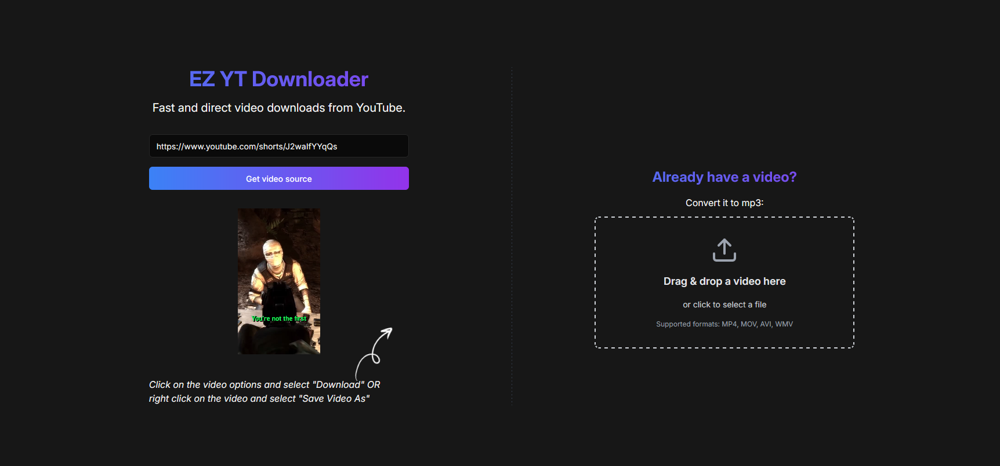

## EZ YT Downloader

### Features

- Download YouTube videos directly from their URL.
- Convert downloaded videos to MP3 format without uploading them to the server.
- No need to install any software on your computer.

### Usage

1. Paste the YouTube video URL into the input field on the homepage.
2. Click the "Get video source" button.
3. The server will fetch the source, providing an embedded video which can be right clicked and saved as MP4.

### Development

- Install dependencies: `pnpm install`
- Start the development server: `pnpm dev`

### Notes

- The application uses Invidious API instances specified in the `YT_PROVIDER_URLS` environment variable to fetch YouTube video data.
- Supports only a single resolution of the video.
- Can't trigger video download directly beacuse it's a cross-origin resource, the advantage is that I don't have to keep up to date with yt-dlp dependencies or anything.
- Since Youtube's API is not being used, it shouldn't break any TOS.
